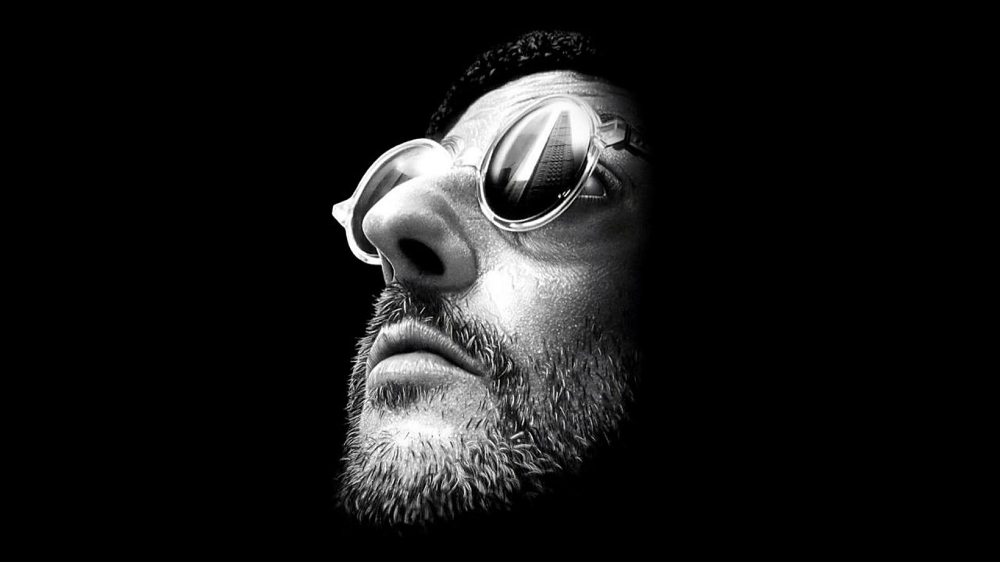

# Single-Line-Doodles
This Python project converts images into single-line drawings using a random spline-based approach. 

## Examples:

## Acknowledgments

This project was inspired by [Sergej Stoppel](https://www.boredpanda.com/algorithm-doodle-style-single-line-drawings-sergej-stoppel/) who's blog motivated me to dive into creative coding and explore generative art.
Thank you for the inspiration!
